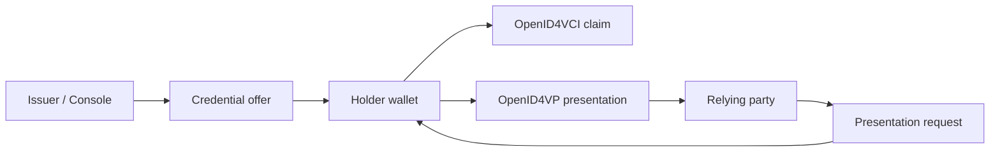

The Didit holder wallet is a browser-based wallet for the Didit ID ecosystem. It gives holders a passkey-secured place to claim credentials, review requests, and present only the claims they approve.

This page describes the product-level flow. For protocol details, see [OpenID4VCI](/concepts/openid4vci), [OpenID4VP](/concepts/openid4vp), and [SD-JWT VC](/concepts/sd-jwt-vc).

## Wallet and API boundary

The wallet calls public protocol endpoints. It does not use tenant API keys and cannot manage schemas, templates, trust policy, API keys, or webhooks.

## Claim pipeline

<Steps>
  <Step title="Open the offer">
    The holder opens a claim link from email or scans a claim QR.
  </Step>
  <Step title="Review the credential">
    The wallet shows the issuer, credential type, and transaction-code requirement.
  </Step>
  <Step title="Approve with passkey-secured access">
    The holder signs in or confirms access with a passkey-capable browser.
  </Step>
  <Step title="Run OpenID4VCI">
    The wallet redeems the offer, gets a nonce, sends the holder proof, and receives the SD-JWT VC.
  </Step>
  <Step title="Store the credential">
    The credential becomes available in the wallet for later presentations.
  </Step>
</Steps>

## Present pipeline

<Steps>
  <Step title="Receive the verifier request">
    The holder opens a QR or same-device link from the relying party.
  </Step>
  <Step title="Match credentials">
    The wallet looks for credentials with the requested `vct` and requested claim names.
  </Step>
  <Step title="Show consent">
    The wallet shows the relying party, issuer, credential type, and exact claims requested.
  </Step>
  <Step title="Build the presentation">
    The wallet creates an SD-JWT VC presentation with only the approved disclosures and the request binding required by OpenID4VP.
  </Step>
  <Step title="Submit the response">
    The wallet submits the `vp_token` to Didit ID. The verifier receives the final `verdict` and disclosed claims.
  </Step>
</Steps>

## Selective disclosure

The wallet never needs to disclose the whole credential when the verifier asks for one fact.

For example, an employee badge can include `employee_id`, `role`, and `department`. If VeriBank requests only `role`, the wallet presents only `role`. The verifier can trust the disclosed role after Didit ID verifies the issuer signature, holder binding, audience, nonce, lifecycle state, and trust policy.

## Next steps

<CardGroup cols={2}>
  <Card title="Wallet security" icon="shield-halved" href="/wallet/security">
    Learn how passkeys, consent, and selective disclosure protect holder data.
  </Card>
  <Card title="Build your own wallet" icon="code" href="/guides/holder-wallet">
    Implement the same standards-based holder flows.
  </Card>
</CardGroup>
