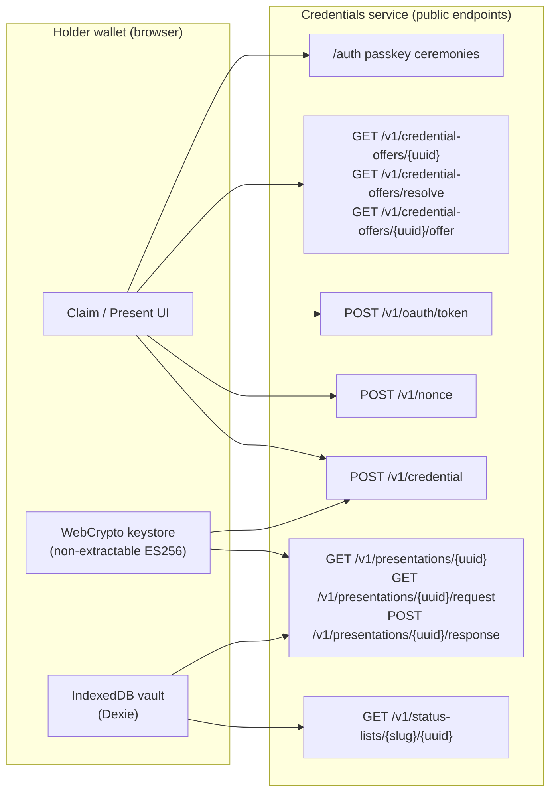

The wallet is a browser app with no server-side holder state. It holds keys and credentials locally, and it reaches the credentials service only through public protocol endpoints. This page describes its moving parts.

## Wallet and service boundary

The wallet calls the public OpenID4VCI/VP protocol endpoints and the passkey auth ceremonies. It never calls a management endpoint and never holds a tenant API key.



## Holder key model

The wallet generates **one non-extractable ECDSA P-256 (ES256) key per credential** with WebCrypto:

```js
const pair = await crypto.subtle.generateKey(
  { name: "ECDSA", namedCurve: "P-256" },
  false,       // extractable: false — the private key can never leave the browser
  ["sign"],
);
```

- **Non-extractable.** The browser can sign with the private key, but no code — including the wallet's — can read the key material out. It survives structured-clone into IndexedDB as an opaque `CryptoKey`.
- **Public key only ever exported.** The wallet exports just the public JWK (`kty`, `crv`, `x`, `y`) for the proof JWT header and for matching against the credential's `cnf.jwk`.
- **`cnf` binding.** At issuance the credential's `cnf.jwk` is set to this public key. After the credential comes back, the wallet checks `cnf.jwk` equals the key it generated and rejects the credential on a mismatch — so a credential can only ever be bound to a key this wallet controls.
- **One key per credential.** Keys are not shared across credentials. Presenting a credential uses that credential's own key to sign the KB-JWT.

## IndexedDB vault schema

Storage is a single IndexedDB database, `didit-wallet`, via Dexie. Every row is scoped by a **`vaultId`** so multiple accounts can share one browser profile without seeing each other's data:

```
vaultId = base64url( sha256( email.trim().toLowerCase() ) )
```

Four object stores:

| Store | Key | Holds |
| --- | --- | --- |
| `credentials` | `id` | The full compact SD-JWT VC (`<jws>~<d1>~…~<dn>~`), `vct`, issuer, resolved `claims`, `sdClaimNames`, `issuedAt`/`expiresAt`, the `statusRef`, cached `statusState`, and the `keyId`. |
| `keys` | `id` | The non-extractable `CryptoKey` private key, its `publicJwk`, `alg` (`ES256`), and the `credentialId` it belongs to. |
| `activity` | `id` | An audit trail: `issued`, `presented`, `status`, `deleted` events with timestamps, verifier, disclosed claim names, and verdict. |
| `statusLists` | `uri` | Cached IETF Token Status List bitstrings (`bitsB64`) for revocation checks. |

Compound indexes (`[vaultId+vct]`, `[vaultId+statusState]`, `[vaultId+at]`) make per-account lookups by type, status, and time cheap.

## SD-JWT handling

The wallet parses, selects, and presents SD-JWT VC credentials.

- **Parse (decoy-tolerant).** The compact issuance is `<issuer-jws>~<disclosure_1>~…~<disclosure_n>~`. The parser splits on `~`, decodes each disclosure, and recursively resolves `_sd` digest arrays against the disclosure map. Digests with no matching disclosure are **decoys** and are ignored silently, per the SD-JWT spec. Parsing validates structure only — signature verification is the verifier's job. It requires `_sd_alg` (when present) to be `sha-256` and tolerates the legacy `vc+sd-jwt` `typ`.
- **Disclosure selection.** When presenting, the wallet selects only the requested disclosures and preserves issuance order. Requested names that are not selectively disclosable claims are ignored.
- **KB-JWT.** The key-binding JWT proves holder control. Its `sd_hash` is `base64url(sha256(presented-part))`, where the presented part is `<jws>~<d1>~…~<dk>~` — **including the trailing tilde**. The empty-disclosure case hashes `"<jws>~"`. The KB-JWT header is `{ typ: "kb+jwt", alg: "ES256" }` and its payload carries `nonce`, `aud`, `iat`, and `sd_hash`. The final `vp_token` is `<jws>~<selected disclosures>~<kb-jwt>`.

## The OpenID4VCI claim pipeline

Claiming a credential is a resolve → token → nonce → proof → credential sequence, then a local verify-and-store:

<Steps>
  <Step title="Resolve the offer">
    From a claim link (`/claim?offer=<uuid>`), a raw code, or a foreign `credential_offer_uri`, the wallet resolves the holder preview. It uses `GET /v1/credential-offers/{uuid}`, or `GET /v1/credential-offers/resolve?tenant=<slug>&code=<pre_auth_code>`, or fetches the offer document at `GET /v1/credential-offers/{uuid}/offer` and then resolves by `(tenant, code)`.
  </Step>
  <Step title="Redeem the pre-authorized code">
    `POST /v1/oauth/token` with the pre-authorized-code grant and, when required, the transaction code. Returns a short-lived holder access token. A wrong PIN is recoverable; five wrong PINs lock the offer.
  </Step>
  <Step title="Generate the holder key + read issuer metadata">
    Generate a fresh non-extractable ES256 key and read the issuer's `.well-known/openid-credential-issuer`. The proof JWT's `aud` is that metadata's `credential_issuer`.
  </Step>
  <Step title="Mint a nonce and sign the proof">
    `POST /v1/nonce` mints a single-use `c_nonce` immediately before signing. The wallet signs an `openid4vci-proof+jwt` with the holder private key, the public JWK in the header, and the nonce bound in.
  </Step>
  <Step title="Receive and verify the credential">
    `POST /v1/credential` returns the SD-JWT VC. The wallet parses it and confirms its `cnf.jwk` equals the key it generated. On mismatch, it rejects the credential.
  </Step>
  <Step title="Store atomically">
    The credential row and its key row are written to the vault together, and an `issued` activity entry is logged.
  </Step>
</Steps>

## The OpenID4VP present pipeline

Presenting a credential is a fetch-request → match → consent → build → submit sequence:

<Steps>
  <Step title="Fetch the request">
    From a present link (`/present?request=<uuid>`), the wallet fetches both the presentation detail (`GET /v1/presentations/{uuid}`) and the authoritative request params (`GET /v1/presentations/{uuid}/request`) — the `client_id` (audience) and `nonce`. A request that was already used is rejected; presentation requests are single-use.
  </Step>
  <Step title="Match the vault">
    The wallet matches stored credentials against the request's `requested_vct` and `requested_claims`. Zero matches → a no-match screen; one match → straight to consent; several → a picker.
  </Step>
  <Step title="Consent to disclosure">
    The consent screen shows the verifier, the credential type, and exactly the requested claims. The holder approves which claims to disclose.
  </Step>
  <Step title="Build and submit the vp_token">
    The wallet builds the presentation — selected disclosures plus a KB-JWT bound to the request's `aud` and `nonce` — and submits it to `POST /v1/presentations/{uuid}/response`. A failed verification comes back as a final verdict (not retried); the submit is single-shot and never replayed against the same request.
  </Step>
  <Step title="Log the outcome">
    A `presented` activity entry records the verifier, the disclosed claim names, and the verdict.
  </Step>
</Steps>

## Revocation checks

When the wallet needs a credential's live status, it reads the `status_list` reference from the credential's `status` claim (an `{ idx, uri }` pointing at `GET /v1/status-lists/{slug}/{uuid}`), fetches and caches the bitstring, and checks the bit at `idx`. Bit order is LSB-first within each byte, matching the service; an out-of-range index reads as not revoked.

<Note>
  See [wallet security](/wallet/security) for the current status-list format (raw bits) and the roadmap to a signed status-list token.
</Note>

## Next steps

<CardGroup cols={2}>
  <Card title="Security model" icon="shield-halved" href="/wallet/security">
    The two key domains, what leaves the browser, and the threat model.
  </Card>
  <Card title="Build your own wallet" icon="code" href="/guides/holder-wallet">
    Implement these pipelines in your own app.
  </Card>
</CardGroup>
